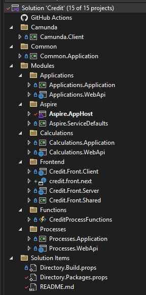
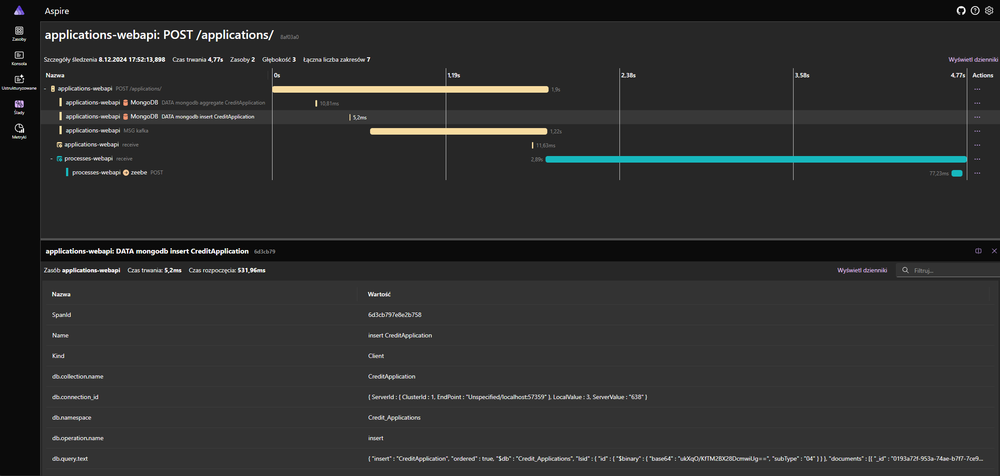

# workflow-camunda-sample

An example of using the camunda platfrom to control the process with kafka

## Application modules

## Tracing

## to run
* configure the `Aspire.AppHost` [appsetings.json](Modules/Aspire/Aspire/Aspire.AppHost/appsettings.json) profile. 
* run `Aspire.AppHost`

## external depedencies
* camunda-startup
	* https://github.com/rafalkopryk/CamundaStartup
	* update command `git subtree pull --prefix external/camunda-startup camunda-startup master --squash`
